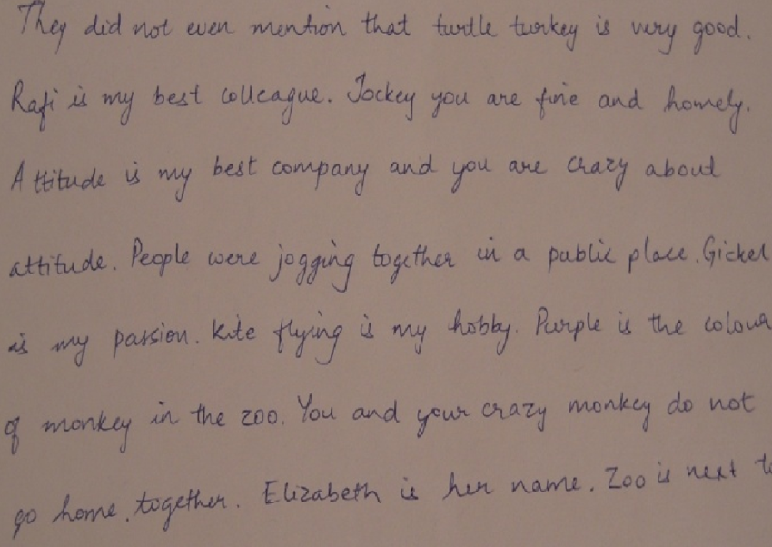
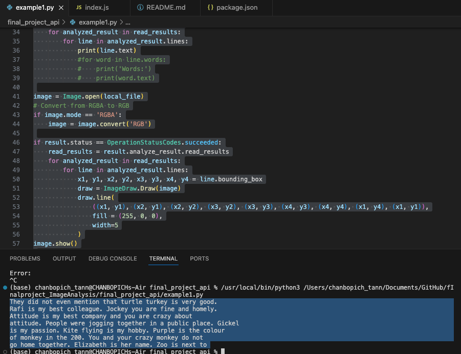

# Final Project Documentation
---

# API Name: Image Analysis

## Purpose

This API facilitates various image processing tasks like handwriting extraction, landmark detection, and image description using Azure Cognitive Services. It provides functionalities to interact with Azure's Computer Vision API.

## Getting Started

### Installation

To get started, ensure you have Python installed. Then, clone the repository and install the required dependencies using the following commands:

```bash
git clone https://github.com/chanbopich11tann/finalproject_ImageAnalysis.git
cd final_project_api
```

### Authentication

1. I obtained an API key and endpoint from Azure Cognitive Services.
2. I created a `credential.json` file in the root directory with the following structure:

```json
{
    "API_KEY": "d5dab499fc804fb28355568d460055f8",
    "ENDPOINT": "https://ai-vision-api-demo.cognitiveservices.azure.com/"
} 
```

## Usage

### 1. Handwriting Extraction

#### Purpose

The Handwriting Extraction functionality in our API utilizes Azure Cognitive Services to detect and extract handwritten text from images. Detail Code can be found in `example1.py` file.


#### Explanation

The provided code snippet demonstrates the process of extracting handwritten text from an image using our API, leveraging Azure Cognitive Services' AI Vision capabilities.

1. **Loading Credentials:** The code initializes the API client by loading the necessary credentials from the `credential.json` file.

2. **Initializing the Client:** It creates the Computer Vision client using the loaded credentials to interact with Azure Cognitive Services.

3. **Handwriting Extraction:** The API performs handwriting extraction on a local image file (for example, `1.png`) in `Images` folder by sending a request to the Cognitive Services API and retrieving the extracted text.

The Original Handwriting Image: 


4. **Text Annotation:** The script visualizes the extracted text by drawing bounding boxes around the identified text lines on the image.

The Extracted Text: 


The Extracted Image: 


5. **Saving the Modified Image:** The modified image, with highlighted text areas, is saved in a new folder named 'New Generated Images' as 'handwriting_result.jpg'.


Certainly! Here's the documentation for Landmark Detection functionality of your API:

---

### Landmark Detection

#### Purpose

The Landmark Detection feature in our API utilizes Azure Cognitive Services to identify landmarks within images. Detail Code can be found in `exampl2.py` file.

#### Explanation

This code snippet demonstrates how to detect landmarks within an image using our API with Azure Cognitive Services' Computer Vision capabilities.

1. **Loading Credentials:** The code initializes the API client by loading the necessary credentials from the `credential.json` file.

2. **Initializing the Client:** It creates the AI Vision client using the loaded credentials to interact with Azure Cognitive Services.

3. **Landmark Detection:** The API performs landmark detection on an image (for example, `landmark1.png`) in `Images` folder by sending a request with the specified domain to Cognitive Services API and retrieves detected landmarks.

The Original Landmark Image: 


4. **Display and Annotation:** The script visualizes the detected landmarks by annotating the image with the names of identified landmarks and displays it.

The Detected Landmark:


5. **Saving the Modified Image:** The annotated image, showing identified landmarks, is saved in a new folder named 'New Generated Images' as 'annotated_landmark_image.jpg'.


Absolutely! Here's the documentation for Image Description within your API:

---

### Image Description


#### Purpose
The Image Description feature within our API employs Azure Cognitive Services to generate textual descriptions for images. Detail Code can be found in `example3.py` file.


#### Explanation

This code demonstrates how to describe an image using our API with Azure Cognitive Services' Computer Vision capabilities.

1. **Loading Credentials:** The code initializes the API client by loading the necessary credentials from the `credential.json` file.

2. **Initializing the Client:** It creates the Computer Vision client using the loaded credentials to interact with Azure Cognitive Services.

3. **Image Description:** The API analyzes the provided image URL to generate textual descriptions. It retrieves multiple descriptions and their confidence levels for the image.

The Original Image via URL:


4. **Annotating Image:** The script displays the top description on the image and saves the modified image as 'described_image.jpg' in the 'New Generated Images' directory.

The Described Image: 


